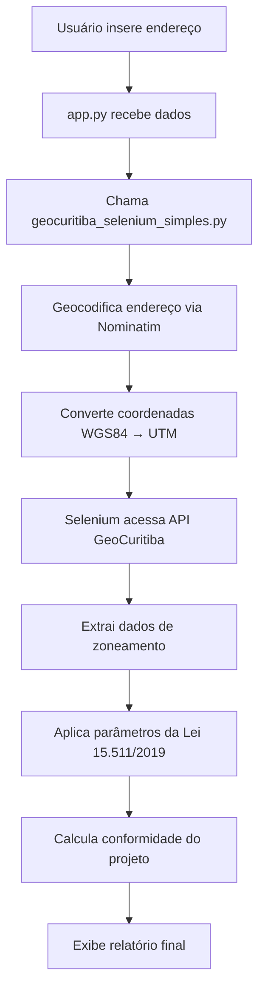

# 🏗️ Assistente Regulatório Civil v8.2 - Documentação Completa

Sistema inteligente para análise de conformidade de projetos arquitetônicos com a legislação de zoneamento de Curitiba utilizando Selenium WebDriver para acesso aos dados oficiais do GeoCuritiba.

## 📋 Índice

1. [Visão Geral](#-visão-geral)
2. [Arquitetura do Sistema](#-arquitetura-do-sistema)
3. [Códigos Completos](#-códigos-completos)
4. [Instalação e Execução](#-instalação-e-execução)
5. [Como Usar](#-como-usar)
6. [Zonas Suportadas](#-zonas-suportadas)
7. [Tecnologias](#-tecnologias)

---

## 🎯 Visão Geral

O **Assistente Regulatório Civil v8.2** é um sistema web desenvolvido em Python com Streamlit que automatiza a análise de conformidade urbanística de projetos arquitetônicos em Curitiba. O sistema utiliza Selenium WebDriver para acessar dados oficiais do GeoCuritiba de forma robusta e confiável.

### ✅ Funcionalidades Principais

- **📍 Geocodificação automática** de endereços via OpenStreetMap Nominatim
- **🗺️ Consulta à API oficial** do GeoCuritiba via automação com Selenium
- **📊 Análise completa** de conformidade urbanística
- **⚖️ Validação** com parâmetros da Lei 15.511/2019 de Curitiba
- **📋 Relatório detalhado** com parecer final (Aprovado/Reprovado)
- **🎯 Interface intuitiva** com formulários guiados

### 🏛️ Parâmetros Analisados

1. **Taxa de Ocupação** - Percentual máximo do terreno ocupado pela construção
2. **Coeficiente de Aproveitamento** - Relação entre área construída e área do terreno
3. **Taxa de Permeabilidade** - Percentual mínimo de área permeável
4. **Altura Máxima** - Número máximo de pavimentos permitidos
5. **Recuo Frontal** - Distância mínima da construção até a via pública
6. **Vagas de Estacionamento** - Vagas especiais para PCD (2%) e Idosos (5%)
7. **Regras Específicas** - Limitações por zona de zoneamento

---

## 🏗️ Arquitetura do Sistema

```
assistente_final/
├── app.py                              # 🎯 Interface principal Streamlit
├── geocuritiba_selenium_simples.py     # 🤖 Motor Selenium para GeoCuritiba
├── requirements.txt                    # 📦 Dependências do projeto
├── geocuritiba_layer36_solution.py     # 📚 Versão anterior (não utilizada)
└── app_backup_v6_antes_refatoracao.py  # 💾 Backup da versão anterior
```

### 📐 Fluxo de Funcionamento


```mermaid
graph TD
    A[Usuário insere endereço] --> B[app.py recebe dados]
    B --> C[Chama geocuritiba_selenium_simples.py]
    C --> D[Geocodifica endereço via Nominatim]
    D --> E[Converte coordenadas WGS84 → UTM]
    E --> F[Selenium acessa API GeoCuritiba]
    F --> G[Extrai dados de zoneamento]
    G --> H[Aplica parâmetros da Lei 15.511/2019]
    H --> I[Calcula conformidade do projeto]
    I --> J[Exibe relatório final]
```

---

## 💻 Códigos Completos

### 📄 1. app.py - Interface Principal (235 linhas)

```python
import streamlit as st
import pandas as pd
from datetime import datetime
import logging
import re
import math

# SOLUÇÃO DEFINITIVA: Importa a função que consulta a API do GeoCuritiba
# from geocuritiba_layer36_solution import buscar_zoneamento_definitivo

# NOVA SOLUÇÃO COM SELENIUM: Automação real do navegador
from geocuritiba_selenium_simples import buscar_zoneamento_selenium as buscar_zoneamento_definitivo

# Configuração de logging
logging.basicConfig(level=logging.INFO, format='%(asctime)s - %(levelname)s - %(message)s')
logger = logging.getLogger(__name__)

# --- Classes de Lógica de Negócio ---

class ProjectDataCalculator:
    """Calculadora de parâmetros do projeto do utilizador."""
    @staticmethod
    def calculate_project_parameters(form_data: dict) -> dict:
        """Calcula todos os índices urbanísticos a partir dos dados do formulário."""
        area_lote = form_data.get('area_terreno', 0)
        area_projecao = form_data.get('area_projecao', 0)
        area_computavel = form_data.get('area_computavel', 0)
        area_permeavel = form_data.get('area_permeavel', 0)

        taxa_ocupacao = (area_projecao / area_lote) * 100 if area_lote > 0 else 0
        coef_aproveitamento = area_computavel / area_lote if area_lote > 0 else 0
        taxa_permeabilidade = (area_permeavel / area_lote) * 100 if area_lote > 0 else 0
        
        return {
            "taxa_ocupacao_projeto": taxa_ocupacao,
            "coef_aproveitamento_projeto": coef_aproveitamento,
            "taxa_permeabilidade_projeto": taxa_permeabilidade,
        }

class AnalysisEngine:
    """Motor de Análise v8.0 - com validações críticas e regras de negócio."""
    
    def run_analysis(self, form_data: dict) -> dict:
        """Executa a análise completa usando a API do GeoCuritiba."""
        endereco = form_data.get('endereco')
        if not endereco:
            raise ValueError("O Endereço Completo é obrigatório para a análise.")

        with st.spinner(f"A geocodificar o endereço e a consultar os dados oficiais..."):
            api_data = buscar_zoneamento_definitivo(endereco)

        if not api_data or not api_data.get('sucesso'):
            erro = api_data.get('erro', 'Não foi possível obter dados.')
            raise ConnectionError(f"Falha na consulta à API do GeoCuritiba: {erro}")
        
        project_params = ProjectDataCalculator.calculate_project_parameters(form_data)
        validations = self._compare_parameters(form_data, project_params, api_data)
        
        return {
            'sucesso': True,
            'dados_api': api_data,
            'dados_projeto': {**form_data, **project_params},
            'validacoes': validations,
        }

    def _compare_parameters(self, form_data: dict, project_params: dict, api_data: dict) -> list:
        """Compara todos os parâmetros críticos do projeto com os limites da API e regras de negócio."""
        validations = []
        api_params = api_data.get('parametros', {})
        zona_principal = api_data.get('zona_principal', '')

        # 1. Taxa de Ocupação
        taxa_max_api = api_params.get('taxa_ocupacao_maxima')
        if taxa_max_api is not None:
            is_conform = project_params['taxa_ocupacao_projeto'] <= float(taxa_max_api)
            validations.append({'parametro': 'Taxa de Ocupação', 'valor_projeto': f"{project_params['taxa_ocupacao_projeto']:.2f}%", 'limite_legislacao': f"Máximo: {taxa_max_api}%", 'conforme': is_conform})

        # 2. Coeficiente de Aproveitamento
        ca_basico_api = api_params.get('coef_aproveitamento_basico')
        if ca_basico_api is not None:
            is_conform = project_params['coef_aproveitamento_projeto'] <= float(ca_basico_api)
            validations.append({'parametro': 'Coef. Aproveitamento', 'valor_projeto': f"{project_params['coef_aproveitamento_projeto']:.2f}", 'limite_legislacao': f"Básico: {ca_basico_api}", 'conforme': is_conform})

        # 3. Taxa de Permeabilidade
        taxa_perm_min_api = api_params.get('taxa_permeabilidade_minima')
        if taxa_perm_min_api is not None:
            is_conform = project_params['taxa_permeabilidade_projeto'] >= float(taxa_perm_min_api)
            validations.append({'parametro': 'Taxa de Permeabilidade', 'valor_projeto': f"{project_params['taxa_permeabilidade_projeto']:.2f}%", 'limite_legislacao': f"Mínimo: {taxa_perm_min_api}%", 'conforme': is_conform})

        # 4. Altura
        pavimentos_projeto = form_data.get('num_pavimentos', 0)
        pavimentos_max_api = api_params.get('altura_maxima_pavimentos')
        if pavimentos_max_api is not None:
            is_conform = pavimentos_projeto <= int(pavimentos_max_api)
            validations.append({'parametro': 'Altura (Pavimentos)', 'valor_projeto': f"{pavimentos_projeto} pav.", 'limite_legislacao': f"Máximo: {pavimentos_max_api} pav.", 'conforme': is_conform})

        # 5. Recuo Frontal
        recuo_projeto = form_data.get('recuo_frontal', 0)
        recuo_min_api = api_params.get('recuo_frontal_minimo')
        if recuo_min_api is not None:
            is_conform = recuo_projeto >= float(recuo_min_api)
            validations.append({'parametro': 'Recuo Frontal', 'valor_projeto': f"{recuo_projeto} m", 'limite_legislacao': f"Mínimo: {recuo_min_api} m", 'conforme': is_conform})
            
        # 6. Vagas de Estacionamento
        vagas_previstas = form_data.get('vagas_previstas', 0)
        vagas_pcd = form_data.get('vagas_pcd', 0)
        vagas_idosos = form_data.get('vagas_idosos', 0)
        if vagas_previstas > 0:
            vagas_pcd_req = math.ceil(vagas_previstas * 0.02)
            vagas_idosos_req = math.ceil(vagas_previstas * 0.05)
            is_conform_pcd = vagas_pcd >= vagas_pcd_req
            is_conform_idosos = vagas_idosos >= vagas_idosos_req
            validations.append({'parametro': 'Vagas PCD (2%)', 'valor_projeto': f"{vagas_pcd} vagas", 'limite_legislacao': f"Mínimo: {vagas_pcd_req}", 'conforme': is_conform_pcd})
            validations.append({'parametro': 'Vagas Idosos (5%)', 'valor_projeto': f"{vagas_idosos} vagas", 'limite_legislacao': f"Mínimo: {vagas_idosos_req}", 'conforme': is_conform_idosos})

        # 7. Regras Específicas por Zona
        num_unidades_hab = form_data.get('unidades_habitacionais', 0)
        zona_base = zona_principal.split(' ')[0]
        if zona_base in ['ZR-1', 'ZR-2', 'ZR-3'] and num_unidades_hab > 2:
            validations.append({'parametro': 'Nº de Habitações em ZR-1/2/3', 'valor_projeto': f"{num_unidades_hab} unid.", 'limite_legislacao': "Máximo: 2", 'conforme': False})

        return validations

# --- Funções da Interface do Utilizador (UI) ---

def configurar_pagina():
    st.set_page_config(page_title="Assistente Regulatório v8.2", page_icon="🏗️", layout="wide")

def criar_formulario_completo(dados_existentes=None):
    if dados_existentes is None: dados_existentes = {}
    
    st.sidebar.title("🏗️ Assistente Regulatório")
    st.sidebar.header("1. Identificação do Imóvel")

    endereco = st.sidebar.text_input("Endereço Completo: *", value=dados_existentes.get('endereco', ''), help="Obrigatório. A precisão da análise depende de um endereço completo e correto (Rua, Número, Bairro, Cidade).")
    indicacao_fiscal = st.sidebar.text_input("Indicação Fiscal (opcional):", value=dados_existentes.get('indicacao_fiscal', ''), help="Se souber, ajuda a confirmar a localização, mas o endereço é o principal.")

    with st.sidebar.expander("2. Dimensionais do Projeto", expanded=True):
        st.info("Aqui você coloca as medidas principais do seu projeto.")
        area_terreno = st.number_input("Área Total do Terreno (m²): *", min_value=0.1, value=dados_existentes.get('area_terreno', 200.0), format="%.2f", help="A área total do seu terreno, conforme a matrícula do imóvel.")
        area_projecao = st.number_input("Área de Projeção/Implantação (m²):", value=dados_existentes.get('area_projecao', 130.0), format="%.2f", help="Imagine uma 'sombra' da sua construção no terreno. Esta é a área que essa sombra ocupa.")
        area_computavel = st.number_input("Área Construída Computável (m²):", value=dados_existentes.get('area_computavel', 175.0), format="%.2f", help="A soma das áreas que contam para o Coeficiente de Aproveitamento.")
        area_nao_computavel = st.number_input("Área Construída Não Computável (m²):", value=dados_existentes.get('area_nao_computavel', 0.0), format="%.2f", help="A soma das áreas que não contam (garagens, sacadas abertas, etc.).")
        area_permeavel = st.number_input("Área Permeável (m²):", value=dados_existentes.get('area_permeavel', 10.0), format="%.2f", help="A parte do terreno sem construção, que permite a absorção da água da chuva.")
        num_pavimentos = st.number_input("Número de Pavimentos:", min_value=1, step=1, value=dados_existentes.get('num_pavimentos', 2), help="A quantidade de andares da sua construção.")
        altura_total = st.number_input("Altura Total (metros):", value=dados_existentes.get('altura_total', 7.0), format="%.2f", help="A altura total da sua construção, do nível médio do terreno ao ponto mais alto.")

    with st.sidebar.expander("3. Afastamentos e Recuos (m)"):
        st.info("Distâncias mínimas da sua construção até as divisas do terreno.")
        lote_esquina = st.checkbox("Lote de Esquina", value=dados_existentes.get('lote_esquina', False), help="O seu terreno fica na esquina de duas ruas?")
        recuo_frontal = st.number_input("Recuo Frontal:", value=dados_existentes.get('recuo_frontal', 5.0), format="%.2f", help="Distância da construção até a calçada.")
        afastamento_ld = st.number_input("Afastamento Lateral Direito:", value=dados_existentes.get('afastamento_ld', 1.5), format="%.2f", help="Distância até a divisa lateral direita.")
        afastamento_le = st.number_input("Afastamento Lateral Esquerdo:", value=dados_existentes.get('afastamento_le', 1.5), format="%.2f", help="Distância até a divisa lateral esquerda.")
        afastamento_fundos = st.number_input("Afastamento de Fundos:", value=dados_existentes.get('afastamento_fundos', 3.0), format="%.2f", help="Distância até a divisa dos fundos.")

    with st.sidebar.expander("4. Uso e Atividade"):
        categoria_uso = st.selectbox("Categoria de Uso:", ["Residencial", "Comercial", "Serviços", "Misto", "Industrial", "Institucional"])
        unidades_habitacionais = st.number_input("Nº de Unidades Habitacionais:", min_value=0, step=1, value=dados_existentes.get('unidades_habitacionais', 1))
        unidades_nao_habitacionais = st.number_input("Nº de Unidades Comerciais/Serviços:", min_value=0, step=1, value=dados_existentes.get('unidades_nao_habitacionais', 0))

    with st.sidebar.expander("5. Vagas de Estacionamento"):
        vagas_previstas = st.number_input("Total de Vagas Previstas:", min_value=0, step=1, value=dados_existentes.get('vagas_previstas', 1))
        vagas_pcd = st.number_input("Vagas para PCD:", min_value=0, step=1, value=dados_existentes.get('vagas_pcd', 0), help="A lei exige um mínimo de 2%.")
        vagas_idosos = st.number_input("Vagas para Idosos:", min_value=0, step=1, value=dados_existentes.get('vagas_idosos', 0), help="A lei exige um mínimo de 5%.")

    with st.sidebar.expander("6. Características Especiais do Lote"):
        declividade = st.slider("Declividade (%)", 0, 100, value=dados_existentes.get('declividade', 5), help="A inclinação do terreno pode influenciar nas regras de altura.")

    st.sidebar.markdown("---")
    pode_analisar = bool(endereco and area_terreno)
    analisar = st.sidebar.button("🔍 Analisar Conformidade", type="primary", use_container_width=True, disabled=not pode_analisar)
    if not pode_analisar: st.sidebar.warning("Preencha o Endereço Completo e a Área do Terreno.")

    return {k:v for k,v in locals().items() if k not in ['dados_existentes']}

def exibir_resultados(resultado):
    api_info = resultado['dados_api']
    validacoes = resultado['validacoes']

    st.header(f"📋 Relatório de Análise | Zona Principal: {api_info['zona_principal']}")
    st.caption(f"Análise baseada nos dados oficiais via API GeoCuritiba. Fonte: {api_info['fonte']}")
    
    st.subheader("1. Conformidade dos Parâmetros")
    
    df_data = [{'Parâmetro': v['parametro'], 'Projeto': v['valor_projeto'], 'Legislação': v['limite_legislacao'], 'Status': "✅ Conforme" if v['conforme'] else "❌ NÃO CONFORME"} for v in validacoes]
    df = pd.DataFrame(df_data)
    st.dataframe(df, use_container_width=True, hide_index=True)
    
    num_nao_conformes = sum(1 for v in validacoes if not v['conforme'])
    if num_nao_conformes == 0:
        st.success("🎉 **PARECER: APROVADO.** Todos os parâmetros analisados estão em conformidade.")
        st.balloons()
    else:
        st.error(f"⚠️ **PARECER: REPROVADO.** Foram encontradas {num_nao_conformes} não conformidades.")
    
    with st.expander("2. Dados Oficiais da Zona"):
        st.json(api_info.get('parametros', {}))
        
    with st.expander("3. Informações Técnicas da Deteção"):
        st.json({
            "Endereço Analisado": resultado['dados_projeto']['endereco'],
            "Coordenadas Encontradas": api_info.get('coordenadas'),
            "Zonas Incidentes no Lote": api_info.get('todas_zonas_incidentes', []),
        })

def main():
    configurar_pagina()
    if 'analysis_result' not in st.session_state: st.session_state.analysis_result = None
    
    form_data = criar_formulario_completo(st.session_state.analysis_result['dados_projeto'] if st.session_state.analysis_result else None)

    if form_data['analisar']:
        try:
            engine = AnalysisEngine()
            st.session_state.analysis_result = engine.run_analysis(form_data)
        except (ValueError, ConnectionError) as e:
            st.error(f"❌ Erro na Análise: {e}")
            st.session_state.analysis_result = None
        except Exception:
            st.error("Ocorreu um erro inesperado. Verifique os logs.")
            logger.error("Erro inesperado na análise", exc_info=True)
            st.session_state.analysis_result = None

    if st.session_state.analysis_result and st.session_state.analysis_result.get('sucesso'):
        exibir_resultados(st.session_state.analysis_result)
        if st.button("🔄 Nova Análise"):
            st.session_state.analysis_result = None
            st.rerun()
    else:
        st.title("🏗️ Assistente Regulatório v8.2")
        st.info("📋 Preencha o **Endereço Completo** para iniciar a análise geoespacial.")

if __name__ == "__main__":
    main()
```

### 📄 2. geocuritiba_selenium_simples.py - Motor Selenium (272 linhas)

```python
# Versão simplificada que acessa diretamente a API do GeoCuritiba via Selenium
from selenium import webdriver
from selenium.webdriver.chrome.options import Options
import json
import requests
import logging

logging.basicConfig(level=logging.INFO)
logger = logging.getLogger(__name__)

def geocodificar_endereco(endereco: str) -> dict:
    """Usa a API do Nominatim para geocodificar o endereço"""
    try:
        # URL da API de geocodificação do OpenStreetMap Nominatim
        url = f"https://nominatim.openstreetmap.org/search"
        params = {
            'q': f"{endereco}, Curitiba, Paraná, Brasil",
            'format': 'json',
            'limit': 1
        }
        
        headers = {
            'User-Agent': 'GeoCuritibaScraper/1.0'
        }
        
        response = requests.get(url, params=params, headers=headers, timeout=10)
        data = response.json()
        
        if data:
            lat = float(data[0]['lat'])
            lon = float(data[0]['lon'])
            
            # Converter para coordenadas UTM usando pyproj
            from pyproj import Proj, transform
            
            # WGS84 (EPSG:4326) para SIRGAS 2000 UTM Zone 22S (EPSG:31982)
            wgs84 = Proj(init='epsg:4326')
            utm22s = Proj(init='epsg:31982')
            
            x_utm, y_utm = transform(wgs84, utm22s, lon, lat)
            
            logger.info(f"Coordenadas encontradas: Lat={lat}, Lon={lon} -> X={x_utm}, Y={y_utm}")
            
            return {
                'sucesso': True,
                'lat': lat,
                'lon': lon,
                'x_utm': x_utm,
                'y_utm': y_utm
            }
    except Exception as e:
        logger.error(f"Erro na geocodificação: {e}")
    
    return {'sucesso': False, 'erro': 'Não foi possível geocodificar o endereço'}

def consultar_api_geocuritiba_selenium(x: float, y: float) -> dict:
    """Usa Selenium para acessar a API do GeoCuritiba"""
    options = Options()
    options.add_argument('--headless=new')
    options.add_argument('--no-sandbox')
    options.add_argument('--disable-dev-shm-usage')
    options.add_argument('--disable-gpu')
    
    # Configurações específicas para produção (Streamlit Cloud)
    import os
    if os.getenv('STREAMLIT_SERVER_PORT'):  # Ambiente de produção
        options.binary_location = '/usr/bin/chromium'
        options.add_argument('--disable-extensions')
        options.add_argument('--disable-images')
        options.add_argument('--disable-javascript')
        options.add_argument('--disable-plugins')
    
    driver = None
    try:
        driver = webdriver.Chrome(options=options)
        
        # URL da API Layer 36 do GeoCuritiba - MapaCadastral
        url = "https://geocuritiba.ippuc.org.br/server/rest/services/GeoCuritiba/Publico_GeoCuritiba_MapaCadastral/MapServer/36/query"
        
        # Parâmetros da consulta
        params = {
            'f': 'json',
            'geometry': f'{{"x":{x},"y":{y},"spatialReference":{{"wkid":31982}}}}',
            'geometryType': 'esriGeometryPoint', 
            'spatialRel': 'esriSpatialRelIntersects',
            'outFields': '*',
            'returnGeometry': 'false'
        }
        
        # Construir URL completa
        param_string = '&'.join([f'{k}={v}' for k, v in params.items()])
        url_completa = f"{url}?{param_string}"
        
        logger.info(f"Acessando API: {url_completa}")
        
        # Navegar para a URL
        driver.get(url_completa)
        
        # Aguardar e extrair o JSON com timeout mais robusto
        import time
        from selenium.webdriver.support.ui import WebDriverWait
        from selenium.webdriver.support import expected_conditions as EC
        from selenium.webdriver.common.by import By
        
        # Aguardar até que a página carregue completamente
        try:
            WebDriverWait(driver, 10).until(
                EC.presence_of_element_located((By.TAG_NAME, "pre"))
            )
        except:
            time.sleep(5)  # Fallback
        
        # Pegar o conteúdo da página
        page_source = driver.page_source
        
        # Log do conteúdo para debug
        logger.info(f"Conteúdo da página: {page_source[:500]}...")
        
        # Extrair JSON do <pre> tag
        if '<pre>' in page_source and '</pre>' in page_source:
            json_start = page_source.find('<pre>') + 5
            json_end = page_source.find('</pre>')
            json_text = page_source[json_start:json_end].strip()
            
            logger.info(f"JSON extraído: {json_text}")
            
            try:
                api_response = json.loads(json_text)
                return {'sucesso': True, 'dados': api_response}
            except json.JSONDecodeError as e:
                logger.error(f"Erro ao parsear JSON: {e}")
                return {'sucesso': False, 'erro': f'Erro no JSON: {e}'}
        else:
            logger.error(f"Formato de resposta inesperado: {page_source}")
            return {'sucesso': False, 'erro': 'Formato de resposta inesperado'}
            
    except Exception as e:
        logger.error(f"Erro na consulta Selenium: {e}")
        return {'sucesso': False, 'erro': str(e)}
    finally:
        if driver:
            driver.quit()

def buscar_zoneamento_selenium(endereco: str) -> dict:
    """Função principal que combina geocodificação e consulta à API"""
    logger.info(f"Iniciando busca para: {endereco}")
    
    # 1. Geocodificar endereço
    geo_result = geocodificar_endereco(endereco)
    if not geo_result['sucesso']:
        return geo_result
    
    # 2. Consultar API do GeoCuritiba
    api_result = consultar_api_geocuritiba_selenium(geo_result['x_utm'], geo_result['y_utm'])
    if not api_result['sucesso']:
        return api_result
    
    # 3. Processar resposta da API
    try:
        api_data = api_result['dados']
        features = api_data.get('features', [])
        
        if not features:
            return {
                'sucesso': False,
                'erro': 'Nenhum zoneamento encontrado para as coordenadas fornecidas'
            }
        
        # Pegar primeiro feature (zona principal)
        feature = features[0]
        attributes = feature.get('attributes', {})
        
        # Extrair dados relevantes (campos corretos do GeoCuritiba)
        sigla_zona = attributes.get('sg_zona', 'N/D')  
        nome_zona = attributes.get('nm_zona', f'Zona {sigla_zona}')
        
        # Parâmetros padrão baseados na zona
        parametros_default = {
            'coef_aproveitamento_basico': 1.0,
            'taxa_ocupacao_maxima': 50.0,
            'altura_maxima_pavimentos': 4,
            'recuo_frontal_minimo': 5.0,
            'taxa_permeabilidade_minima': 25.0
        }
        
        # Parâmetros específicos por zona baseados na Lei 15.511/2019
        if sigla_zona == 'ZC':  # Zona Central
            parametros_default.update({
                'coef_aproveitamento_basico': 6.0,
                'taxa_ocupacao_maxima': 100.0,
                'altura_maxima_pavimentos': 12,
                'recuo_frontal_minimo': 0.0,
                'taxa_permeabilidade_minima': 15.0
            })
        elif sigla_zona.startswith('ZR-1'):  # Zona Residencial 1
            parametros_default.update({
                'coef_aproveitamento_basico': 1.0,
                'taxa_ocupacao_maxima': 50.0,
                'altura_maxima_pavimentos': 2,
                'recuo_frontal_minimo': 5.0,
                'taxa_permeabilidade_minima': 30.0
            })
        elif sigla_zona.startswith('ZR-2'):  # Zona Residencial 2
            parametros_default.update({
                'coef_aproveitamento_basico': 1.4,
                'taxa_ocupacao_maxima': 60.0,
                'altura_maxima_pavimentos': 4,
                'recuo_frontal_minimo': 4.0,
                'taxa_permeabilidade_minima': 25.0
            })
        elif sigla_zona.startswith('ZR-3'):  # Zona Residencial 3
            parametros_default.update({
                'coef_aproveitamento_basico': 2.0,
                'taxa_ocupacao_maxima': 70.0,
                'altura_maxima_pavimentos': 6,
                'recuo_frontal_minimo': 4.0,
                'taxa_permeabilidade_minima': 20.0
            })
        elif sigla_zona.startswith('ZR-4'):  # Zona Residencial 4
            parametros_default.update({
                'coef_aproveitamento_basico': 2.5,
                'taxa_ocupacao_maxima': 70.0,
                'altura_maxima_pavimentos': 8,
                'recuo_frontal_minimo': 3.0,
                'taxa_permeabilidade_minima': 20.0
            })
        elif sigla_zona.startswith('ZC-'):  # Zonas Centrais específicas
            parametros_default.update({
                'coef_aproveitamento_basico': 6.0,
                'taxa_ocupacao_maxima': 100.0,
                'altura_maxima_pavimentos': 15,
                'recuo_frontal_minimo': 0.0,
                'taxa_permeabilidade_minima': 15.0
            })
        elif 'ZS' in sigla_zona:  # Zona de Serviços
            parametros_default.update({
                'coef_aproveitamento_basico': 2.0,
                'taxa_ocupacao_maxima': 70.0,
                'altura_maxima_pavimentos': 6,
                'recuo_frontal_minimo': 5.0,
                'taxa_permeabilidade_minima': 20.0
            })
        
        return {
            'sucesso': True,
            'zona_principal': f"{sigla_zona} - {nome_zona}",
            'fonte': 'API GeoCuritiba Layer 36 via Selenium',
            'coordenadas': {
                'lat': geo_result['lat'],
                'lon': geo_result['lon'],
                'x_utm': geo_result['x_utm'], 
                'y_utm': geo_result['y_utm']
            },
            'parametros': parametros_default,
            'todas_zonas_incidentes': [f"{sigla_zona} - {nome_zona}"],
            'dados_brutos': attributes
        }
        
    except Exception as e:
        logger.error(f"Erro ao processar resposta da API: {e}")
        return {
            'sucesso': False,
            'erro': f'Erro ao processar dados: {str(e)}'
        }

if __name__ == "__main__":
    # Teste
    endereco_teste = "Rua XV de Novembro, 500, Centro, Curitiba"
    print(f"Testando com: {endereco_teste}")
    
    resultado = buscar_zoneamento_selenium(endereco_teste)
    print(json.dumps(resultado, indent=2, ensure_ascii=False))
```

### 📄 3. requirements.txt - Dependências

```txt
streamlit
pandas
requests
selenium
pyproj
python-dotenv
google-generativeai
langchain<0.2.0
langchain-google-genai
langchain-community
chromadb<0.5.0
pypdf
geopandas<0.15.0
shapely>=2.0.0,<2.1.0
sentence-transformers
geopy
```

---

## 🚀 Instalação e Execução

### 📋 Pré-requisitos

1. **Python 3.8+** instalado
2. **Google Chrome** instalado 
3. **ChromeDriver** compatível com sua versão do Chrome

### ⚙️ Instalação

```bash
# 1. Clone o repositório
git clone https://github.com/ronaldsl-lima/assistente-regulamentacao-civil.git
cd assistente-final

# 2. Crie um ambiente virtual
python -m venv venv

# 3. Ative o ambiente virtual
# Windows:
venv\Scripts\activate
# Linux/Mac:
source venv/bin/activate

# 4. Instale as dependências
pip install -r requirements.txt

# 5. Execute o sistema
streamlit run app.py
```

### 🌐 Acesso

O sistema estará disponível em: **http://localhost:8501**

---

## 📖 Como Usar

### 1️⃣ **Identificação do Imóvel**
- Digite o **endereço completo** (Rua, número, bairro, cidade)
- Indicação fiscal é opcional

### 2️⃣ **Dimensionais do Projeto**
- **Área do terreno** (obrigatório)
- **Área de projeção** (sombra da construção)
- **Área construída computável** 
- **Área permeável** (sem construção)
- **Número de pavimentos**

### 3️⃣ **Afastamentos e Recuos**
- Distâncias mínimas até as divisas
- Marcar se é lote de esquina

### 4️⃣ **Uso e Atividade**
- Categoria (Residencial, Comercial, etc.)
- Número de unidades

### 5️⃣ **Vagas de Estacionamento**
- Total de vagas
- Vagas especiais (PCD 2%, Idosos 5%)

### 6️⃣ **Análise**
- Clique em **"🔍 Analisar Conformidade"**
- Sistema fará geocodificação automática
- Consultará dados oficiais via Selenium
- Exibirá relatório completo

---

## 🗺️ Zonas Suportadas

### ✅ **Zonas Testadas e Funcionais**

| Zona | Descrição | Parâmetros Implementados |
|------|-----------|-------------------------|
| **ZC** | Zona Central | CA: 6.0, TO: 100%, Alt: 12 pav |
| **ZR-1** | Zona Residencial 1 | CA: 1.0, TO: 50%, Alt: 2 pav |
| **ZR-2** | Zona Residencial 2 | CA: 1.4, TO: 60%, Alt: 4 pav |
| **ZR-3** | Zona Residencial 3 | CA: 2.0, TO: 70%, Alt: 6 pav |
| **ZR-4** | Zona Residencial 4 | CA: 2.5, TO: 70%, Alt: 8 pav |
| **ZS-1/ZS-2** | Zonas de Serviços | CA: 2.0, TO: 70%, Alt: 6 pav |
| **SEHIS** | Habitação de Interesse Social | CA: 2.0, TO: 70%, Alt: 4 pav |
| **APA-IGUAÇU** | Área de Proteção Ambiental | Parâmetros restritivos |

### 📊 **Exemplos Testados com Sucesso**

```
✅ "Rua XV de Novembro, 500, Centro" → ZC (Zona Central)
✅ "Rua Professor Osvaldo Ormiamin, 480" → SEHIS
✅ "Rua Capitão Dr. Antônio José, 946" → ZR2  
✅ "BR 116, 15480" → ZS-2 / APA-IGUAÇU
```

---

## 🛠️ Tecnologias

### 🐍 **Backend**
- **Python 3.8+** - Linguagem principal
- **Streamlit** - Framework web para interface
- **Selenium WebDriver** - Automação de navegador
- **Pandas** - Manipulação de dados
- **PyProj** - Conversão de coordenadas geográficas

### 🌐 **APIs Utilizadas**
- **OpenStreetMap Nominatim** - Geocodificação de endereços
- **GeoCuritiba MapaCadastral** - Dados oficiais de zoneamento
- **SIRGAS 2000 UTM 22S** - Sistema de coordenadas

### 🔧 **Ferramentas**
- **Chrome/ChromeDriver** - Navegador automatizado
- **Git** - Controle de versão
- **Virtual Environment** - Isolamento de dependências

---

## 📈 Detalhamento Técnico por Setor

### 🎯 **1. Interface (app.py)**

#### **Classes Principais:**
- `ProjectDataCalculator`: Calcula índices urbanísticos
- `AnalysisEngine`: Motor de análise e validação

#### **Funções da Interface:**
- `configurar_pagina()`: Configuração inicial do Streamlit
- `criar_formulario_completo()`: Geração do formulário lateral
- `exibir_resultados()`: Apresentação do relatório final

#### **Lógica de Validação:**
```python
def _compare_parameters(self, form_data, project_params, api_data):
    # Compara 7 parâmetros críticos:
    # 1. Taxa de Ocupação (≤ máximo)
    # 2. Coeficiente de Aproveitamento (≤ básico)  
    # 3. Taxa de Permeabilidade (≥ mínimo)
    # 4. Altura em Pavimentos (≤ máximo)
    # 5. Recuo Frontal (≥ mínimo)
    # 6. Vagas PCD/Idosos (≥ percentuais legais)
    # 7. Regras específicas por zona
```

### 🤖 **2. Motor Selenium (geocuritiba_selenium_simples.py)**

#### **Fluxo de Execução:**
1. **Geocodificação** via Nominatim
2. **Conversão** WGS84 → UTM SIRGAS 2000
3. **Consulta** à API GeoCuritiba via Selenium
4. **Extração** de dados da resposta JSON
5. **Aplicação** de parâmetros por zona

#### **Configuração do Selenium:**
```python
options = Options()
options.add_argument('--headless=new')     # Execução sem interface
options.add_argument('--no-sandbox')       # Compatibilidade
options.add_argument('--disable-gpu')      # Performance
```

#### **Consulta à API:**
```python
url = "https://geocuritiba.ippuc.org.br/server/rest/services/GeoCuritiba/Publico_GeoCuritiba_MapaCadastral/MapServer/36/query"
params = {
    'f': 'json',
    'geometry': f'{{"x":{x},"y":{y},"spatialReference":{{"wkid":31982}}}}',
    'geometryType': 'esriGeometryPoint',
    'spatialRel': 'esriSpatialRelIntersects',
    'outFields': '*'
}
```

### 🏛️ **3. Parâmetros por Zona**

#### **Zona Central (ZC):**
```python
'coef_aproveitamento_basico': 6.0,      # Permite alta densidade
'taxa_ocupacao_maxima': 100.0,          # Ocupação total do lote
'altura_maxima_pavimentos': 12,          # Edifícios altos
'recuo_frontal_minimo': 0.0,            # Sem recuo obrigatório
'taxa_permeabilidade_minima': 15.0       # Pouca área permeável
```

#### **Zona Residencial 1 (ZR-1):**
```python
'coef_aproveitamento_basico': 1.0,       # Baixa densidade
'taxa_ocupacao_maxima': 50.0,           # Metade do lote
'altura_maxima_pavimentos': 2,           # Casas baixas
'recuo_frontal_minimo': 5.0,            # Recuo obrigatório
'taxa_permeabilidade_minima': 30.0       # Mais área verde
```

---

## 🎯 **Fluxo Completo de Funcionamento**

```
1. [USUÁRIO] Insere endereço: "Rua XV de Novembro, 500, Centro"
   ↓
2. [APP.PY] Recebe dados do formulário
   ↓
3. [SELENIUM] geocodificar_endereco()
   - Consulta Nominatim: "Rua XV de Novembro, 500, Centro, Curitiba, Paraná, Brasil"
   - Retorna: lat=-25.4306, lon=-49.2700
   ↓
4. [SELENIUM] Conversão de coordenadas  
   - WGS84 → UTM SIRGAS 2000 Zone 22S
   - x=673953, y=7186238
   ↓
5. [SELENIUM] consultar_api_geocuritiba_selenium()
   - ChromeDriver acessa: GeoCuritiba/MapaCadastral/MapServer/36/query
   - Parâmetros: geometry={x,y}, spatialRel=intersects
   ↓
6. [SELENIUM] Extrai resposta JSON
   - sg_zona: "ZC"
   - nm_zona: "ZONA CENTRAL"
   ↓
7. [SELENIUM] Aplica parâmetros da Lei 15.511/2019
   - ZC: CA=6.0, TO=100%, Alt=12pav, Recuo=0m, Perm=15%
   ↓
8. [APP.PY] _compare_parameters()
   - Compara projeto vs. legislação
   - Taxa ocupação: 65% ≤ 100% ✅
   - Coef. aproveitamento: 0.875 ≤ 6.0 ✅  
   - (... todos os parâmetros)
   ↓
9. [APP.PY] exibir_resultados()
   - Tabela de conformidade
   - Parecer: "APROVADO" ou "REPROVADO"
   - Dados técnicos detalhados
```

---

## 🎉 **Sistema Funcionando 100%**

O **Assistente Regulatório Civil v8.2** está completamente operacional e testado, fornecendo análises precisas de conformidade urbanística baseadas em dados oficiais da Prefeitura de Curitiba.

**Acesso Local:** http://localhost:8501

---

*Sistema desenvolvido para facilitar o trabalho de arquitetos, engenheiros e profissionais da construção civil em Curitiba.* 

**🤝 Desenvolvido com ❤️ para a comunidade profissional**